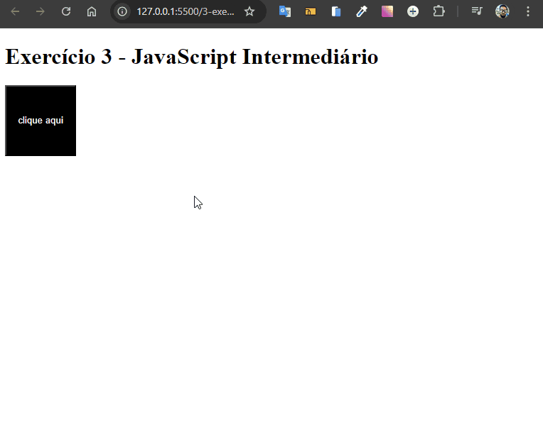

# Alterar Cor do Botão

Desenvolvido como exercício de JavaScript intermediário do curso de extensão universitária do DevQuest - Dev em Dobro.

Este projeto é um exercício simples em JavaScript que permite alterar a cor de um botão ao ser clicado. É uma prática de manipulação do DOM e eventos de clique em JavaScript.



## Tecnologias Utilizadas

- **HTML**
- **CSS**
- **JavaScript**

## Como Usar

1. Clone o repositório:

   ```bash
   git clone https://github.com/Alberesbass/alterar-cor-do-botao.git
   ```

2. Abra o arquivo `index.html` no navegador e clique no botão para ver a cor sendo alterada.

## Licença

Este projeto está sob a licença MIT. Consulte o arquivo [LICENSE](./LICENSE) para mais informações.

---

Desenvolvido por [Alberes](https://github.com/Alberesbass)

---